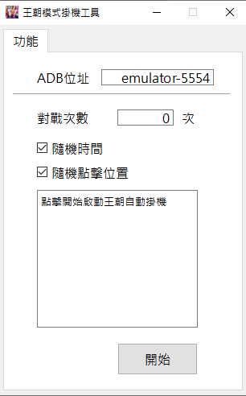

# 全明星街球派對自動掛機程式

這個自動掛機程式專為遊戲「全明星街球派對」設計，能在雷電模擬器上自動運行遊戲。

## 開始之前

在使用這個自動掛機程式之前，請確保您已經安裝雷電模擬器(LdPlayer)並進行了必要的設定。

### 必要設定

1. 開啟雷電模擬器。
2. 點擊模擬器右側工具列的「設定」。
3. 選擇「其他設定」。
4. 確保「ADB調試」選項已開啟，並啟用「開啟本機連結」。

## 尋找ADB位址

請參考
https://blog.csdn.net/qq_39574690/article/details/127255284

## 使用方法

1. 打開`main.exe`。
2. 輸入剛才找到的ADB位址(預設起始設備為emulator-5554)。
3. 點擊開始啟動自動掛機。

## 注意事項

- 確保在使用此程式期間，雷電模擬器保持運行狀態。
- 此程式僅用於個人學習和研究，請勿用於非法用途。

## 聯絡方式

如有任何問題，請透過以下方式聯絡我們：[your-email@example.com]

祝您使用愉快！
